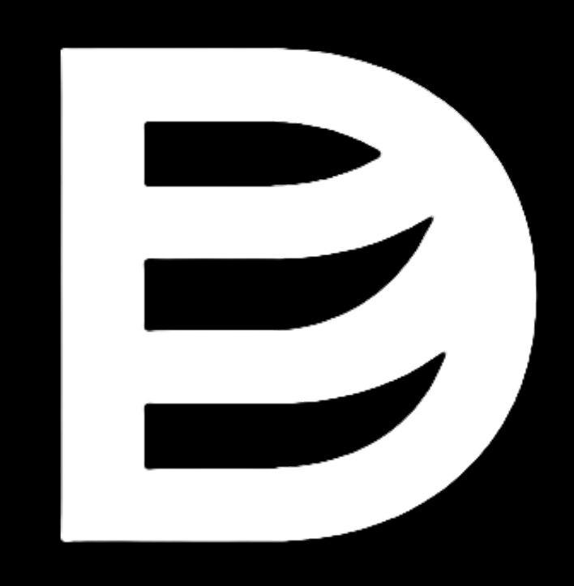

# CAD Challenges Hub

A competitive platform for mechanical design engineers to participate in tournaments, solve challenges, and compete on leaderboards.



## Project Overview

CAD Challenges Hub is a platform where:

- **Individual Engineers**: Participate in tournaments, solve challenges, and compete on leaderboards
- **Organizations**: Create tournaments, monitor participants, manage challenges, and view analytics

## Tech Stack

- **Monorepo**: Nx workspace
- **Frontend**: React Router v7 + TypeScript + tailwindcss + shadcn/ui
- **Authentication**: Better Auth
- **UI Components**: Custom component library in `libs/ui` that wraps `shadcn/ui` components

## Getting Started

### Prerequisites

- Node.js (v18 or higher)
- pnpm

### Installation

1. Clone the repository
```bash
git clone https://github.com/Dexengstudio/cad-hub.git
cd cad-hub
```

2. Install dependencies
```bash
pnpm install
```

3. Start the development server
```bash
pnpm nx serve web
```

The application will be available at http://localhost:4200.

## Development Workflow

### Running commands

This project uses Nx, which provides a set of powerful tools for monorepos. Here are some common commands:

```bash
# Start the development server for the web app
pnpm nx serve or dev web

# Build the web app for production
pnpm nx build web

# Run tests for the UI library
pnpm nx test ui

# Lint the web app
pnpm nx lint web

# Generate a new component in the web app
pnpm nx g @nx/react:component MyComponent --project=web
```

### Project Structure

The main parts of the application are:

- `apps/web`: The main web application
- `libs/ui`: Shared UI component library

## Contributing

Interested in contributing? Check out our [Contributing Guide](./CONTRIBUTING.md).

## License

This project is licensed under the MIT License - see the [LICENSE](LICENSE) file for details.
